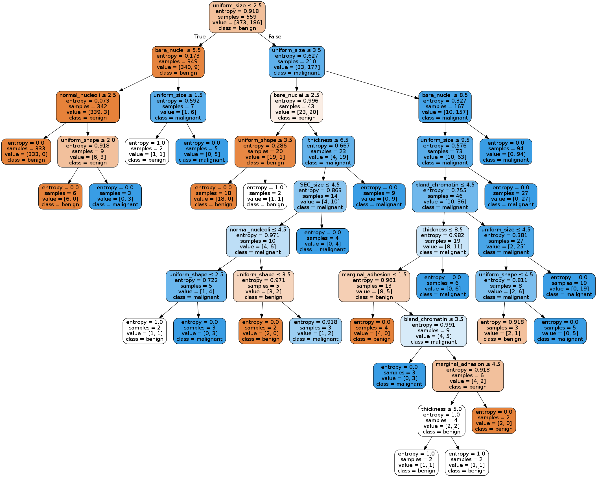

# Breast Cancer Classification using Decision Tree

In this code, we use a decision tree with hyperparamater tuning to classify breast cancer tumours as either benign or malignant.

Dataset: [Wisconsin Breast Cancer Database](https://archive.ics.uci.edu/ml/machine-learning-databases/breast-cancer-wisconsin/)

Accuracy: 95%

Confusion Matrix with pretty annotation: [Link](https://github.com/hundredblocks/concrete_NLP_tutorial/blob/master/NLP_notebook.ipynb)

### Decision Tree
